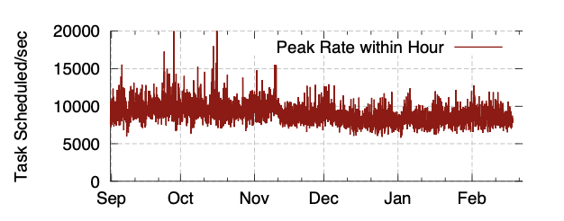

An investigation on [Apollo of OSDI 2014](https://www.usenix.org/conference/osdi14/technical-sessions/presentation/boutin)
============================

## Definition

A highly scalable and coordinated **scheduling framework**
performing scheduling decisions in a distributed manner,
utilizing global cluster infomation via a loosely coordinated mechanism.

## What's the problem to be solved

Efficient scheduling tracking task dependencies and assigning tasks to servers
for execution when ready is critical to the overall system performance and
service quality. The growing popularity and diversity of data-parallel computation
makes scheduling increasingly challenging. A scheduler must (i) scale to make tens
of thousands of scheduling decisions per second on a cluster with tens of thousands
of servers; (ii) maintain fair sharing of resources among different users and groups;
(iii) make high-quality scheduling decisions that take into account factors such as
data locality, job characteristics, and server load to minimize job latencies while
utilizting the resources in a cluster fully.

## Tech

- **To balance scalability and scheduling quality**, Apollo adopts a distributed and
coordinated scheduling framework, in which independent scheduling decisions are
made in an optimistic and coordinated manner by incorporating synchronized
cluster uilization information.
- **To achieve high-quality scheduling decisions**, Apollo schedules each task on a
server that minimizes the task completion time. The estimation model incorporates a
variety of factors and allows a scheduler to perform a weighted decision, rather than
solely considering data locality or server load.
- **To supply individual schedulers with cluster information**, Apollo introduces a
lightweight hardware-independent mechanism to advertise load on servers. When combined
with a local task queue on each server, the mechanism provides a near-future view of
resource availability on all the servers, which is used by the schedulers in decision
making.
- **To cope with unexpected cluster dynamics, suboptimal estimations, and other
abnormal runtime behaviors**, Apollo is made robust through a series of correction
mechanisms that dynamically adjust and rectify suboptimal decisions at runtime.
- **To drive high cluster utilization while maintaining low job latencies**,
Apollo introduces opportunisitic scheduling, which effectively creates two
classes of tasks: regular tasks and opportunistic tasks. Apollo ensures low
latency for regular tasks, while using the opportunistic tasks for high
utilization to fill in the slack left by regular tasks. Apollo further uses
a *token* based mechanism to manage capacity and to avoid overloading the system
by limiting the total number of regular tasks.
- **To ensure no service disruption or performance regression when rolling out
Apollo to replace a previous scheduler deployed in production**, Apollo is designed
to support *staged rollout* to production clusters and *validation at scale*.
 

## Architecture

- **JM**, also called a scheduler, managing the life cycle of each job
- **PN**, running on each server, managing the local resources on that server and performing local scheduling
- **RM**, aggregating load information from PNs across the cluster continuously, providing a global view of the cluster status for each JM to make informed scheduling decisions

### How RM works

The RM is implemented in a master-slave configuration using Paxos.
The RM is never on the performance critical path: Apollo can continue
to make scheduling decisions even the RM is temporarily unavailable,
once a task is scheduled to a PN, the JM obtains up-to-date load
information directly from the PN via frequent status updates.

### How PNs work

- The PN on each server manages a **queue** of tasks assigned to the server.
Once a task creation request is received, the PN copies the required files
to a local directory using a peer-to-peer data transfer framework combined
with a local cache. The PN monitors CPU and memory usage, considers the
resource requirements of tasks in the queue and executes them when the
capacity is available.
- The PN also provides **feedback** to the JM to help improve accuracy of
task runtime estimation. Once a task starts running, the PN monitors its
overall resource usage and responds to the corresponding JM's status update
requests with information. The JM then uses this information along with
other factors to refine resource usage and predict expected runtime for
tasks from the same stage.
- The PN exposes the load on the current server to be aggregated by its RM.
A solution called **wait-time martrix**, with each cell corresponding to the
expected wait time for a task that requires a certain ammount of CPU and
memory, is used to convey the concerned information. The PN maintains a matrix of expected
wait time s for any hypothetical future task with various resource quotas,
basd on the currently running and queued tasks.The algorithm simulates local 
task execution and evaluates how long a future task with a given CPU/memory 
requirement would wait on this PN to be executed. The PN updates this matrix 
frequently by considering the actual resource situation and the latest task 
runtime and resource estimates. Finally, the PN sends this matrix, along with a 
timestamp, to every JM that has running or queued tasks in this PN. It also sends 
the matrix to the RM using a heartbeat mechanism.

### How JMs work

A JM has to decide which server to schedule a particular task to using the
wait-time matrices in the aggregated view provided by the RM and the individual
characteristics of the task to be scheduled. Apollo takes a solution of a single
unified model using an estimation-based approach.

Apollo considers various factors holistically and performs scheduling by estimating
task completion time. 

First, estimate the task completion time if there is no
failure, denoted by *Esucc*, with the formula:

 *Esucc = I + W + R* (1)

*I* denotes the initialization time for fetching the need files for the task,
*W* denotes the expected wait time coming from a lookup in the wait-time matrix of
the target server with the task resource requirement. *R* denotes the task runtime
consisting of both I/O time and CPU time.

Second, consider the probability of task failure to calculate the final completion time
estimate, denoted by *C*. The RM gathers information on upcoming and past maintenance scheduled
on every server. Togerhter, a success probability *Psucc* is derived and considered
to calculate *C*. A penalty constant *Kfail*, determined empirically, is used
to model the cost of server failure on the completion time.

*C = PsuccEsucc + Kfail(1 - Psucc)Esucc* (2)

**Task Priorities**. A static task priority is annotated per stage by the optimizer through
analyzing the job DAG and calculating the potential critical path of the job execution. Tasks
within a stage are prioritized based on the input size. Apollo schedules tasks and allocates
their resources in a descending order of their priorities.

**Stable Matching**. Apollo schedules tasks with similar priorities in *batches* and turns the
problem of task scheduling into that of *matching* between tasks and servers. For the match of 
each task, Apollo limits the search space to a *candidate set* of servers, including (i) a set
of servers on which inputs of significant sizes are located (ii) a set of servers in the same
rack as those from the first group (iii) two servers randomly picked from a set of lightly-loaded
servers. For each task in a batch, Apollo finds the server with the earliest estimated completion
time as a *proposal* from a task if that is the only proposal assigned. When more than one task
proposes to the same server, the server picks the task whose completion time saving is the
greatest if it is assigned to the server. The tasks not picked withdraw their proposals and enter
the next iteration that tries to match the remaining tasks and servers. The algorithm iterates
until all tasks have been assigned, or until it reaches the maximum number of iterations. The scheduler
then sorts all the matched pairs based on their *quality* to decide the dispatch order. A match
is considered with a higher quality if its task has a lower server wait time. The scheduler
iterates over the sorted matches and dispatches in order until it is out of the allocated capacity.
If opportunisitic scheduling is enable, the scheduler continues to dispatch the tasks until
the opportunistic scheduling limit. To simplify the matching algorithm for a tradeoff between
effciency and quality, Apollo assigns only one task to each server in a single batch. And to mitigate
the consequence that the simplification might lead to suboptimal matches, Apollo do postpone
the dispatched task and later re-evaluate.

**Correction Mechanisms**. Apollo optimistically *defers* any correction until after tasks are
dispatched to PN queues. Correction mechanisms continuously re-evaluate the scheduling decisions
with up-to-date information and make appropriate adjustments whenever necessary.

**Duplicate Scheduling**. When a JM gets fresh information from a PN during task creation, task upgrade,
or while monitoring its queued tasks, it compares the information from this PN ot the information that
was used to make the scheduling decision. The scheduler re-evaluates the decision if (i) the updated
expected wait time is significantly higher than the original; (ii) the expected wait time is greater
than the average among the tasks in the same stage; (iii) the elapsed wait time is already greater than
the average. Any change in the decision triggers scheduling a duplicate task to a new desired server.
Duplicates are discarded when one task starts.

**Randomization**. Apollo adds a small random number to each completion time estimation to help reduce
the chances of conflicts by having different JMs choose different, almost equally desirable, servers.

**Confidence**. The scheduler attributes a lower confidence to older wait-time matrices. When the confidence
in the wait-time matrix is low, the scheduler will produce a pessimistic estimate by looking up the wait
time of a task consuming more CPU and memory.

**Straggler Detection**. Apollo's straggler detection mechanism monitors the rate at which data is processed
and the rate at which CPU is consumed to predict the amount of time remaining for each task. Other tasks
in the same stage are used as a baseline for comparison. When the time it would take to rerun a task is
significantly less than the time it would take to let it complete, a duplicate copy is started. They will
execute in parallel until the first one finishes, or until the duplicate copy caught up with the original
task. The scheduler also monitors the rate of I/O and detects stragglers caused by slow intermediate
inputs.

**Opportunistic Scheduling**. Opportunistic Scheduling is used to take advantage of idle resources whenever
they are available. Tasks can execute either in the *regular* mode, with suffcient tokens to cover its
resource consumption, or in the opportunistic mode without allocated resource. Each scheduler first applies
optimistic scheduling to dispatch regular tasks with its allocated tokens. If all the tokens are utilized and
there are still pending tasks to be scheduled, opportunistic scheduling may be applied to dispatch opportunistic
tasks. To prevent one job from consuming all the idle resouces unfairly, Apollo uses *randomized allocation* to
achieve probabilistic resource fairness for opportunistic tasks. In addtion, Apollo upgrades opportunistic
tasks to regular ones when tokens become available and assigned.

## Evaluation

The figure above shows that Apollo could constantly provide a scheduling rate of above 10,000, reaching up tp 20,000 per second in a
single cluster in 6 months.

The figure above shows the comparison between Apollo and baseline, oracle, which shows that Apollo delivers
excellent job performance compared with the baseline scheduler and its scheduling quality is close to the
optimal case.

This figure shows the distributions of task queuing time. With estimation enabled, Apollo achieves much
more balanced scheduling across servers, which in turn leads to shorter task queuing latency.

Apollo's duplicate scheduling is efficient, with 82% success rates, and accounts for less than 0.5% of
task creations. Such a low correction rate confirms the viability of optimistic scheduling and deferred
corrections for this workload. Apollo is able to catch more than 70% stragglers efficiently and apply
mitigation timely to expedite query execution. Apollo's correction mechanisms are shown effective with
small overhead.

The stable matching algorithm performs within 5% of the optimal matching under the simulated conditions
while the greedy approach was 57% slower than the optimal matching.

## Conclusion

Though Apollo has brought great progress on such a scheduling strategy to adapt cluster computation.
Considering about the growing need of computation at the level of megabytes even terabytes, efficient
scheduling algorithm for clusters plays a critical role nowadays. To solve such decentrilized, loosely,
concurrent computation, better strategies shall be developed to come out with better performance.
