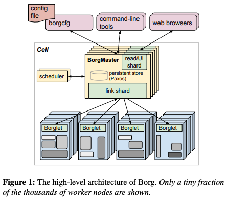
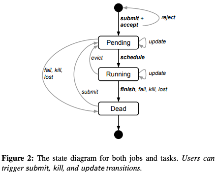
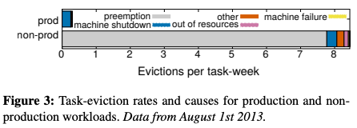

# Borg

## Issues

- hides the details of  resource management and failure handling so its user can focus on application development instead
- operates with very high reliability and availability, and supports applications that do the same
-  lets us run workloads across tens of thousands of machines effectively

### workload

Borg cells内运行着各种各样workload的任务，主要分为两类：long-running services和batch jobs。workload在不同的cell内不尽相同，而且随着时间推移发生着变化。

### cluster

一个集群通常有一个大规模的cell和一些小规模的用来测试或其他目的的cell。

### jobs and tasks

job的属性有name, owner, and the number of tasks，除此之外还有对处理器结构和操作系统等参数的一些限制，但这些限制只是作为可选项而不像前面的属性那样是必选项。

task的属性有资源要求、在job内的index等。在同一个job内的大多数task的属性都是相同的，但是可以通过命令行的参数设置改写。

Borg programs静态地连接在一起以此避免拷贝多个相同的依赖并且被组织成二进制和数据文件的包，这个过程是由Borg精心控制的。

### allocs

take alloc(reserved resource) as task and alloc set(alloc on multiple machine) as job

### admission controll

`priority bands`: monitoring/production/batch/best effort

尽管一个挂起的task总是会被重新安排到cell的的其他地方，但是如果有一个高优先级的任务撞上了一个较低优先级的任务，而这个较低优先级的任务又撞上了另一个更低优先级的任务(...)的情况出现，就会出现“挂起瀑布”。为了避免这种情况的发生，Borg禁止在production优先级层次的job相互排挤。

`quota`: Quota is used to decide which jobs to admit for scheduling. Quota-checking is part of admission control, not scheduling: jobs with insufficient quota are immediately rejected upon submission.

不同优先级的quota不尽相同，production优先级的quota只受整个cell物理资源的限制，而且高于低于其优先级的quota。

### name

“Borg name service” (BNS) name for each task that includes the cell name, job name, and task number.Borg also writes job size and task health information into Chubby whenever it changes.

查找、持久化、DNS构建（also for load balance）

### monitor

几乎每个跑在Borg下的任务都有一个内置的HTTP server，提供健康状态和性能指标。除此之外Borg记录每个application的log，会自动地像ringed array记录，并且会在task退出后保留一段时间以便debug。如果一个job pending了，borg会根据公布的guideline更改job资源。Borg records all job submissions and task events, as well as detailed per-task resource usage information in Infrastore。

## Solutions

A centralized Borg master and borglet agent on every machine

### borgmaster

`main borgmaster process`: handle client RPCs & manage state machines & communicate with borglet & offer web UI for sigma

`scheduler`: scheduling

一个cell里的borgmaster在逻辑上只有一个，实际上有五个副本，通过选举产生一个leader作为整个cell的borgmaster。每个副本都有cell大多数状态的拷贝，既在内存里拷贝也在高可用的分布式存储里持久化存储。一个leader crash后转移到新的leader一般只需10s，但对于一个较大的cell来说需要花费1分钟，因为需要重新构建新leader内存中的状态。

borgmaster的周期性快照和change log会被记录下来，这样做的好处有很多，一来可以帮助Fauxmaster模拟borgmaster复现，二来可以帮助debug等等。

### scheduling

当一个job提交后，borgmaster首先在Paxos上记录这个请求，再将这个job的tasks加入到pending queue。scheduler会由优先级从高到低扫描pending queue，然后找到符合这个task的resource requirement的machines（包括因运行有低优先级任务资源暂时不够，但通过挂起低优先级任务就可以提供足够资源的machines），然后给这些machines打分（打分标准包括用户定义的preference，但多数是由内部定义的指标决定）并从中选出一个执行这个task。

> built-in criteria such as minimizing the number and priority of preempted tasks, picking machines that already have a copy of the task’s packages, spreading tasks across power and failure domains, and packing quality including putting a mix of high and low priority tasks onto a single machine to allow the high-priority ones to expand in a load spike.

### borglet

向上与borgmaster通讯，向下控制tasks。如果borglet所在机器崩溃，borgmaster会将正在这台机器上运行的tasks加到pending queue，等到borglet和borgmaster重新建立连接后，会把原来运行的任务清空。如果borgmaster崩溃，在选举出新的borgmaster前，borglet会保证继续运行在本台机器上的任务直到与新的borgmaster建立连接。在borglet与borgmaster通讯的同时，borgmaster的副本也会跑一个stateless link shard处理和一些borglets的通讯。

### scalability

- borgmaster的主进程将分配任务的scheduler进程独立出来，让scheduler返回分配结果，再由主进程决定是否采用此次的分配，如果拒绝将在下一个scheduler周期重新分配。
- 将与borglet通讯和处理只读请求的RPC分为多个线程，并且把他们分到五个副本中。
- 为score作cache。
- 将有相似或相同资源要求和限制的job分为等同类，borg只为每个等同类里的一个task寻找合适资源并打分。
- scheduler以随机顺序寻找合适资源，在候选资源达到足够值后，就进去打分的步骤

## Techs

It achieves high utilization by combining admission control, efficient task-packing, over-commitment, and machine sharing with process-level performance isolation.

在硬件方面，borg并没有作出什么异于平常的选择。在软件架构上，borg结合了分布式文件系统、使用冗余和选举以及多进（线）程、在E-PVM基础上改进scheduler的算法保证高可用性和一致性。

## Perf.

### availability

> Borgmaster uses a combination of techniques that enable it to achieve 99.99% availability in practice

borg最核心的要求是降低borgmaster的空档时间，因为在borgmaster缺位的时间中，新的请求将被忽略，刚刚完成的task得不到更新

### utilization

### isolation

- security isolation: chroot as primary plus ssh

- performance isolation:  
  - all Borg tasks run inside a Linux cgroup-based resource container and the Borglet manipulates the container settings, giving much improved control because the OS kernel is in the loop. 
  - Borg tasks are classified into latency-sensitive(**LS**) class and the rest, High priority LS tasks are received best treatment.
  - compressible and non-compressible resources 
  - ...

## Reference 

- [Large-scale cluster management at Google with Borg, EuroSys, 2015]([http://delivery.acm.org/10.1145/2750000/2741964/a18-verma.pdf?ip=202.120.40.4&id=2741964&acc=OA&key=BF85BBA5741FDC6E%2E17676C47DFB149BF%2E4D4702B0C3E38B35%2E5945DC2EABF3343C&__acm__=1571972228_ad8d8b54aa7c4fd02a0f2aa5f5a8e97d](http://delivery.acm.org/10.1145/2750000/2741964/a18-verma.pdf?ip=202.120.40.4&id=2741964&acc=OA&key=BF85BBA5741FDC6E.17676C47DFB149BF.4D4702B0C3E38B35.5945DC2EABF3343C&__acm__=1571972228_ad8d8b54aa7c4fd02a0f2aa5f5a8e97d))