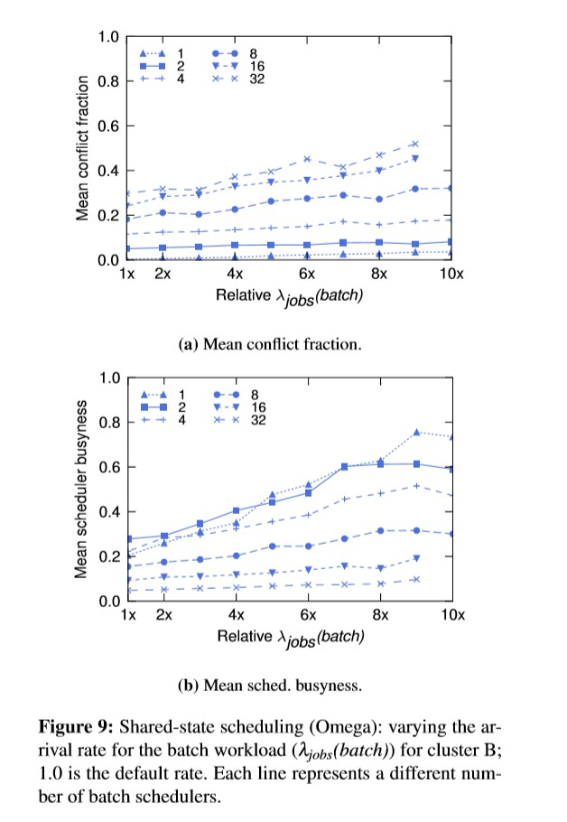

# Omega: flexible, scalable schedulers for large compute clusters

## 要解决的问题

之前我们有几种集群资源管理和调度的框架，比如YARN和Mesos。不过这样的集群调度都有些问题。它们要么是单体式的调度器，这样的调度器不太好，本身会成为集群瓶颈；要么是多个调度器，每个调度器看得到集群的部分资源，这样的话调度器就无法获得集群的全部信息，无法做出最优的调度。

谷歌的解决方案就是多个并行的调度器，调度器通过shared state获得集群的全量信息，同时在并发处理上用了无锁的乐观并发控制。

## 问题背景与需求

负载分为两类，一类叫long-running job，一类叫batch job。前者的运行时间比较长，后者则是短时间的负载。根据谷歌的统计，80%的负载都是batch job，但是大多数的资源（55-80%）都分配给了长时间的负载。这两种任务其实需要区别对待，短的负载可以随便调度调度，浪费太多时间花在调度上反而体验不好。长的负载就需要好好调度了，毕竟要跑很长时间，调度得慢一点无所谓。

谷歌的对上述问题的统计如下图所示。

## 谷歌在设计的时候考虑了什么？

### 如何分配任务（在多个调度器中间）？

文中说了几种设想：要么是是负载均衡，几个调度器轮着分任务；要么是有专门的调度器去调度集群负载中专门的一部分；要么是两个机制的hybrid

### 调度器可以获得哪些信息？全局还是部分？

要么是全部，要么是局部。前者要考虑同步问题，后者要考虑局部资源的分配（静态？动态？）。

### 多个调度器冲突时怎么处理？

乐观处理还是悲观处理？悲观是指显式加锁控制资源访问，乐观是指有第三方将冲突的调度撤销。

### 资源分配的粒度如何控制？

按照job分配还是按照task分配？这是个tradeoff.

### 调度器想做集群级别的操作有什么限制？

几个调度器的公平性？怎么达成共识（比如对负载的优先级的共识，能不能把别人的任务抢下来）？

这里有张图，对比了几种调度器在这几个方面的优劣（定性）。

调度器种类

对比

其中Statically partitioned就是把多个单体强行拼起来，在每个分区下面还是单体。

### 具体的调度器的类型

#### 单体式调度器

一个单一的进程负责所有的工作（资源调度、任务管理、通信等），没有并行，在一份代码中实现所有的调度策略。

这个模式在HPC领域有所应用，但缺点也比较明显，它的扩展性比较差，也可能会成为单点瓶颈。

#### 静态分区的调度器

就是把大集群划分为几个不同的小集群，每个集群中有单独的调度器负责调度特定类型的任务，各个集群之间互不干扰独立运行。优点是可以并发，但缺点是整体性不好。

#### 两层调度器

该类调度器的主要代表是Mesos和YARN。

Mesos有一个中心化的资源分配器，它把资源动态地分配给不同的调度器，基于DRF实现了公平性。这个调度器在小任务多的时候表现比较好，但问题还是每个调度器看不到集群的整体情况，无法做出最优的调度。

YARN则是基于“申请”去实现资源分配的功能的（上面是基于“分配”）。分为Application master和Resource master两大部分。不过这个调度器似乎只会分配，不会调度，缺点比较明显。

#### 共享状态的调度器

文章中描述的这个调度器主要有两点优化措施，第一存在多个调度器，每个调度器都拥有系统全量的资源信息，可以根据该信息进行调度；第二调度器将其调度的结果以原子的方式提交给cell state维护模块，由其决定本次提交是否成功，这里体现了乐观并发的思想。 [2]

不过我认为这个调度器在同步方面的开销可能会比较大，文章中自己都说了这个调度器的性能受上述的调度结果的提交的成功率和失败后的开销有很大的关系。接着作者花了半篇论文去跑模拟数据，最终说明这个开销似乎还可以接受。

## 模拟测试

作者跑的测试大概有下面几种：

* 相同的workload，测试single-path的单体调度器（指没对长任务做优化）、multi-path的单体调度器、共享状态的调度器的平均调度等待时间

* 同样的测试，但记录的是调度器的占用率

* 对Mesos做单独测试，在某个workload下记录平均调度等待时间、调度器的占用率、未被调度的任务数，考虑到这个是两层调度器，几个指标也不好直接比较。

* 共享状态调度器本身的平均冲突率，这个是Omega独有的指标，因为只有Omega用了这种乐观并发的方式。

* 有关MapReduce负载的测试

* 还有一些没仔细看等到编译考完再回来补……

## 应用场景

单点调度已经成为瓶颈时，应用这个调度器会有不错的性能提升。

## 参考资料

[1] Omega: flexible, scalable schedulers for large compute clusters

[2] Google集群管理系统Omega详细解读 https://blog.csdn.net/Kaiyang_Shao/article/details/89950771
